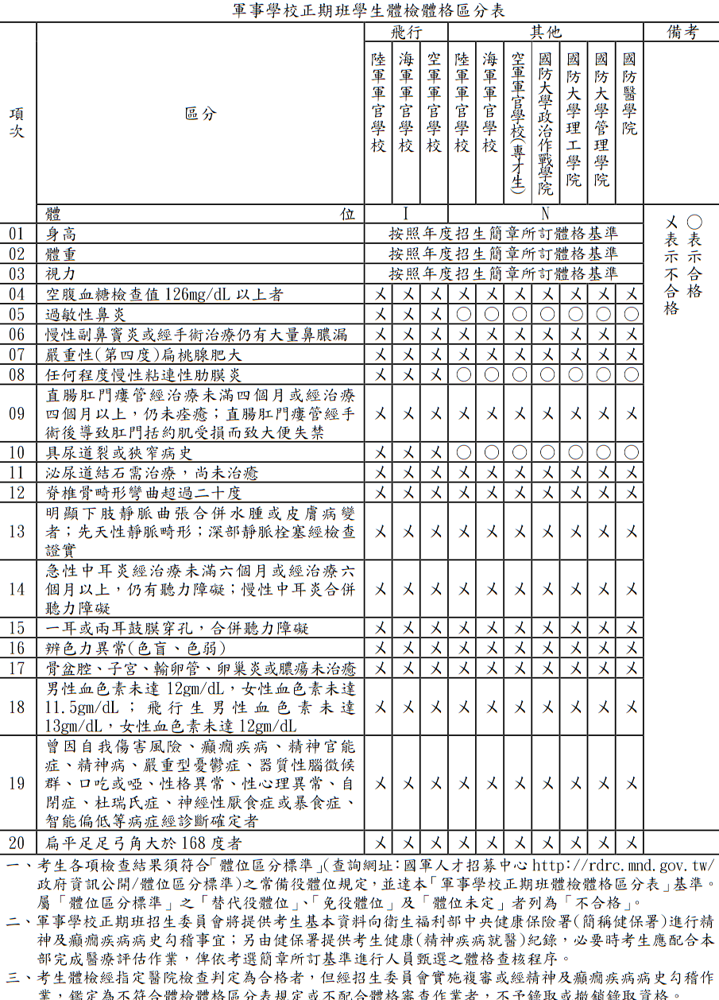

# 110軍校正期班報考心得

本文詳細紀錄了作者報考110年軍校正期班的過程，其中包括了各項流程的準備、注意事項，以及一點小故事。不過最主要的，還是為了想記錄一下高三時的我做了什麼，做個留念。以下文章內容會照著時間線，從109年10月到110年5月，從預約體檢到錄取當天，一步一步進行敘述。

## 給想進軍校但不知從何開始的人 -  找招募員

大概是高二時，因為某些原因，就有想報考軍校了，所以會自己密切關注各種消息，體檢跟智測也是一開放就馬上預約了。不過可能有些人是剛考完學測，才想說要報看看軍校，看完簡章後，一時間要測驗要交資料的，訊息量太多不知道要怎麼報名。這裡提供個方便的管道，就是打電話去招募中心( 080000-0050 )，說需要協助，請求招募員支援 ; 或是詢問學校教官，各高中通常會配有專屬的招募官，總而言之簡單來說 : **找招募官(員)幫忙**。有任何問題，請教招募員就對了，不論今天要讀軍校還是要當志兵，他們都會帶著你，一步一步加入國軍這個大家庭。我自己也有接受過招募官的幫助，很感謝他們協助我報名、解答就讀軍校的相關問題。所以如果有需要的話，請求招募員的協助吧!

## 流程

報考軍校的流程大致如下，待會會照著這個流程走一遍:

1. [體檢](#--體檢)
2. [通過智力測驗、全民國防測驗](#--智力測驗--全民國防)
3. [線上報名](#--線上報名)
4. [寄送各項審查資料 (通訊報名)](#--通訊報名)
5. [口試、面試](#--口試面試)
6. [放榜](#--放榜)
7. [報到、入學](#--報到入學)

## 體檢

先上個體格區分表，O 是可接受的，X 是絕對不合格的。例如如果我有過敏性鼻炎，我還是能報考其他類(一般)，但就不能報考飛行生。

### 1.  預約體檢

> 體檢注意事項([詳細內容](https://rdrc.mnd.gov.tw/EditPage/?PageID=641c7d71-f48a-43a7-98eb-2f059b644678)):
>
> 一、各辦理醫院體檢費用統一收費標準為新臺幣1,400元。
>
> 二、考生僅得擇一指定醫院辦理體檢。
>
> 三、考生如欲上午受檢者，請於前一日下午11時後，勿再進食；如欲下午受檢者，請於當日上午6時後，勿再進食。
>
> 四、女性考生請避開生理期間受檢。
>
> 五、受檢者可利用網路上傳相片電子檔或攜帶本人最近三個月內二吋脫帽半身正面照片乙式二張及身分證明辦理體檢。

回到主線，109年10月中旬開放體檢，早點到國軍人才招募中心網站[預約體檢](https://rdrc.mnd.gov.tw/rdrcnew/tpry/healthreserve.asp?item=92)，首次登入，輸入身分證號，預設密碼是身分證號第1碼 + 民國生日(i.e: A780101)，登入後詳讀系統注意事項及使用說明。選擇預約體檢，挑個有空的時段及離家近的軍醫院，例如我是三軍總醫院松山分院 上午 0830-1030。

### 2 . 醫院報到

到了當天，帶著**1400元、一些零錢、身分證、健保卡、輕便的衣服**(不要有裝飾物或扣子之類的東西)，就可以到醫院報到了。我當天是先到體檢中心報到處，核對資料，填寫個人資料、有沒有重大身心障礙、有沒有吸刺青之類的，裡面有個有趣的問題是問小學成績有沒有在後三分之一。之後再拿報到處給的繳費單去櫃檯交體檢費用1400元。

### 3. 照胸腔

照著地上的線走，首先要照胸腔，找到放射科，如果穿著有裝飾物或扣子的衣服時，就要換醫院給的衣服。照胸腔很快，大概5秒就可以出來了。之後換個很像浴袍的衣服，放置私人物品(置物櫃10元)，即可進入下一階段。

### 4. 量身高體重血壓

> 一般生:
>
> 男性：身高 160 至 195 公分，身體質量指數(BMI)17 至 31。  
>
> 女性：身高 155 至 185 公分，身體質量指數(BMI)17 至 26。
>
> 航空組(飛行生):
>
> 男性：身高 160 至 190 公分，身體質量指數(BMI)18 至 28。
>
> 女性：身高 160 至 190 公分，身體質量指數(BMI)18 至 26。 

這也很快，手臂伸進去10秒血壓就出來了，站上機器抬頭挺胸5秒後身高體重就出來了，[BMI](https://www.calculator.net/bmi-calculator.html)在17 ~ 31左右就沒甚麼大問題。

### 5. 視力檢查

> 一般生 : 最佳矯正視力達 0.6 以上，且兩眼配鏡總度數各在六屈光度(600 度)以內。
>
> 飛行生 : 兩眼祼視各在 0.6 以上，且各眼最佳矯 正視力均達 1.0，並經空勤體檢(空勤視力箱)合格

從小到大近視的我最怕這關過不了...。跟一般診所測視力一樣，遮左眼遮右眼的。沒近視直接上，有近視醫師會先用儀器測眼鏡度數，再請你戴上眼鏡測。戴上小於600度的眼鏡看超過0.6就合格了。最後提一下，如果有打雷射要滿半年確認沒問題才可以(一般生)。

### 6. 心電圖

幾乎是最舒服的一關，躺著過。但那個吸盤一直掉下來，我都懷疑報告上說我心電圖有問題，是因為那吸盤根本沒吸在我胸部上啊?

### 7. 醫生問診

最綜合的，檢查有無身心疾病以及檢查色盲、聽力、扁平足、駝背、生殖器等等等。值得一說的是，原本以為應該是蠻輕鬆的，結果從我剛踏進去診間就被罵了，那位醫師一直叫我動作快，然後一臉不爽，不知道這是一種檢查有無身心疾病的獨特方法還是單純看我不爽XD?

### 8. 抽血驗尿

之後要抽血驗尿，醫院會給三個試管(兩個抽血，一個驗尿用)、一個杯子(裝尿)，去廁所撒泡尿倒進試管就可以了，注意三個試管是不一樣的，不能把尿倒進驗血用的試管。然後最後剩抽血了，手一握緊等一下就過去了，醫生技術好，沒很痛。

### 9. 結束

至此體檢算是結束了，把手上滿滿印章的資料交到體檢中心的櫃台就可以開心的回家了~

### 10. 查詢體檢結果

等大概10個工作天之後，就可以網路查詢體檢結果，到原本申請體檢的網站就可以看到了，登入後點擊資料查詢即可。如果看到體位是 *N* (一般生)或是 *I* (一般生、飛行生)就代表合格囉。如果發現有某一項不合格，可以再回去複檢一次，每項50元。

## 智力測驗 + 全民國防

簡單來說，要報考軍校，除了不能是殘障之外，也不能是智障，至於全民國防測驗則是加分用的。

> 軍事學校正期班報考資格第七條
>
> (一) 國軍智力測驗線上即測即評檢測成績達 100 分者，或曾參加 102 年起國軍各招募班隊智力測驗成績(標準版)達 100 分者，或國軍兵(學)籍資料智力測驗及格(100 分以上)成績證明。
>
> (二) 完成全民國防線上測驗者。

### 1. 預約線上測驗

通過體檢了之後，11月初就可以去國軍人才招募中心網站，[預約智力測驗及全民國防測驗](https://rdrc.mnd.gov.tw/RDRCExamWeb/index.aspx)。首次登入，帳號身分證字號，密碼自行設定。填寫完基本資料，點擊預約報名，選擇時段及考場，按儲存。之後就可以去印准考證了。

### 2. 智力測驗準備

準備方式很簡單，智力測驗可以到預約的網頁上去找練習題，題型分為: 

- 重組
- 數的能力
- 語文推理
- 數系
- 空間關係
- 分析推理
- 圖形推理
- 文法運用

要好好準備智力測驗，沒100分還要重考。題目本身都不難，也不需要特別多的練習，知道怎麼考就好。但由於每大題都有時間限制(每部分12 ~ 13題，5 ~ 6分鐘要寫完，一題大概25秒)，某幾個部分的題目會寫不完，當看到右上角時間剩下20秒時，不用再想了直接用猜的(像我數的能力幾乎都用猜的)。把握好會寫的題目，分數就不會太低了。

### 3. 全民國防測驗準備

> (七) 「全民國防線上測驗」成績特別加分
>
> 1. 80 分至 89 分：增加各科原始級分(分數)0.5%。 
>
> 2. 90 分至 99 分：增加各科原始級分(分數)1%。 
>
> 3. 100 分：增加各科原始級分(分數)2%。

至於全民國防就已經有題庫了，到國軍人才招募中心的[中心服務](https://rdrc.mnd.gov.tw/userfiles/files/14%E4%B8%AD%E5%BF%83%E6%9C%8D%E5%8B%99/109%E5%B9%B4%E5%85%A8%E6%B0%91%E5%9C%8B%E9%98%B2%E9%A1%8C%E5%BA%AB(1).pdf)裡面找就有了。

主要考的大題如下:

- 全民國防
- 國防政策
- 國防科技
- 防衛動員

我的做法很簡單，就是**把所有題目都背起來**，但也不用每題都背，像是是非題，看熟那些 X 的就好，到時候考試發現這題沒印象，那答案就是 O 了。選擇題背正確的選項就好。這裡提一下，凡是有標註來源是**國防報告書**的題目，我都會仔細看熟，因為這些題目有時候憑直覺看上去應該要是O，但正解卻是X，而且還沒詳解，我就滿頭問號為什麼是 X(可能因為我是智障吧)。所以除非去翻國防報告書，不然背起來就好。

全民國防測驗比較簡單，也沒時間壓力，更沒有重考壓力。考試會給6分鐘左右作答，但基本上一部分12題90秒就能作答完畢了(所以剩下時間可以直接趴下來睡覺)，共50題100分。

### 4. 考試當天

考試前睡飽飽，考試當天攜帶**雙證件**，其餘沒必要，紙筆考場會給，不過我是覺得用不太到。

我早上八點就搭著捷運到北區招募中心報到，報到完他會給掛牌及置物櫃鑰匙。考前10分鐘把個人物品放置到置物櫃裡，只能帶著雙證件及掛牌進入考場，其他像是手機等電子產品等一概不能攜入考場。

進入考場後須登入檢測系統，帳號密碼跟預約時的一樣，幹結果當天我就忘記密碼了...QQ(忘記密碼舉手反映就好)。成功登入系統後，閱讀考試說明，等待漫長的倒計時結束，開始作答，系統右上角會有剩餘時間。

考完試後，成績證明現場就會列印出來給你。如果不幸發現智力測驗不合格(只要不是亂考 就不用擔心)，一個月後還可以重考，但若達100分以上，則終生鎖定，全民國防則是一年只能考一次。

## 線上報名

### 1. 報名管道介紹 - 國培、學推、個申

報考軍校有很多管道，個人申請、國防培育班、學校推薦、登記入學、統測等等。在這邊主要只會提國防培育班、學校推薦及個人申請這三個管道，原因很簡單，因為我不清楚其他管道的狀況。

先介紹一下各種管道的差異好了，不講登記入學(中正預校)

- 個人申請 : 完全只看學測成績，可以填五間校系，會列備取生
- 國防培育班 : 也是只看學測成績(但通常錄取分數門檻會比個人申請低)，必須要有國培班的身分，只能填一個校系，不列備取生
- 學校推薦 : 比較不一樣，除了要學測成績之外，還需要推薦信、自傳、備審資料。需要「面」試，限填一個校系，不列備取生

因為我高二就跟學校報名了國防培育班，再加上個申及學推，所以我三種管道都報名了。然後不管使用哪種管道，都需要「口」試 (不是面試)，口試就是聊天而已，目的是確認報考動機及口語表達沒問題，不計入總成績，但一定要及格。學校推薦的話則是口試面試一起進行(一次)。那像我一樣三管齊下的，面試一次就好。

### 2. 登入系統報名

學測放榜後，在 110/03/03 ~ 110/03/26 期間，到國軍人才招募中心做線上報名(必須體檢智測國防測驗都通過了才能登入報名系統)。題外話，這個報名系統好像是剛上線的(不確定)?介面比起以前好看很多，不過可能還存在某些bug(像我的報名信封就載入不出來)。登入報名系統後，填寫基本資料、報考志願序、選考場、問卷等等。當填寫的資料都確認無誤時，就可以按送出資料了，在送出之前可以先預覽報名表。送出後再將報名資料影印出來。

要特別注意，送出資料時要「**確認無誤!!!**」 ，不然發現錯誤，想要修改的話，就要打電話+傳真過去國防部後台請人幫忙解封，非常非常麻煩。我就有親身經歷過，幹只是為了要改出生地跟那個不管怎麼看都是扁扁的照片，害我當時緊張要死。

### 3. 小故事時間 - 你的身分證號已被綁定了喔

進入報名系統第一件事是要註冊帳號，先分享一個悲劇。註冊帳號需要使用者的e-mail跟身分證字號，有人的電子郵件打錯了一個字，想當然的，註冊驗證信沒送到信箱。當他後來想重新註冊時，系統告訴他: 「你的身分證號已被綁定了喔」。 ㄟ幹不對啊，連驗證信都沒收到欸? 系統就把那個打錯一個字的電子郵件跟他的身分證號綁定了??後來怎麼解決呢?大致上就是用傳真的方式把身分證等證明文件寄給國防部的什麼單位，讓後台幫他解除綁定，反正就是各種麻煩。

所以說，**註冊帳號時，不要打錯字!!!**

### 4. 抱怨的，可跳過

抱怨一下，簡章上有規定上傳照片的格式，這邊不贅述，用學校的拍的證件照就好了。最讓我不解的是，為什麼檔案名稱要用身分證(A123456789.jpg)???實體證件相片要在背面寫上身分證號防止不小心跟其他人的混亂，這我可以理解。但檔案存在電腦資料庫裏面，不太理解幹嘛要規定。

## 通訊報名

解釋一下通訊報名在幹嘛，大致上就是將報名資料從報名系統影印出來，再跟其他審查資料一起用牛皮紙袋裝一裝，在110/3/26前寄掛號到正期班招生委員會就可以了。

### 1. 要寄送哪些資料?

要寄送的東西，簡章裡面說得很詳細了，詳請查閱 「[110學年度軍事學校正期班甄選簡章](https://rdrc.mnd.gov.tw/userfiles/files/01%E8%BB%8D%E4%BA%8B%E5%AD%B8%E6%A0%A1%E6%AD%A3%E6%9C%9F%E7%8F%AD/110%E5%AD%B8%E5%B9%B4%E5%BA%A6%E8%BB%8D%E4%BA%8B%E5%AD%B8%E6%A0%A1%E6%AD%A3%E6%9C%9F%E7%8F%AD%E7%94%84%E9%81%B8%E7%B0%A1%E7%AB%A0.pdf)」 第八頁第九點。

以下列出我寄送的報名資料，如果是特殊考生的話，還有其他資料要繳交，請自行翻閱簡章 :

- 報名表
- 110 學年度學科能力測驗成績單影本
- 2 吋照片 1 式 1 張
- 國民身分證影本
- 新式戶口名簿影本(現住人口含詳細記事)
- 140 元郵票(面額 35 元郵票 4 張)
- 學生證影本(具高三下學期註冊章)
- 在學期間獎懲明細紀錄表
- 國軍招募班隊線上測驗成績證明影本
	- 國軍智力測驗線上成績證明
	- 全民國防線上測驗成績證明

還有若是像我一樣有報學校推薦的，還要繳以下資料 :

- 自傳
- 就讀學校師長推薦函
- 高一至高三上，歷年學科成績單
- 其他 (社團參與、競賽成果、學生幹部、全民英檢成績、技能檢定證照、志工服務證明等)

接續前前前段，點擊送出資料後，系統會生成報名表及信封(pdf檔)，將報名表及信封印出來，浮貼上審查資料。注意一下，**戶口名簿影本要有詳細記事**，不能是省略版的。然後要**記得附郵票**，隨報名管道數不同要寄不同張數的郵票，因為招生委員會要寄准考證 + 錄取通知回來。

### 2. 寫推薦信 + 自傳

因為我有報國防理工的學校推薦，所以還要寫推薦信跟自傳。推薦信理應當由學校的師長寫，但...~~我毛遂自薦~~，然後再請教官蓋個章就可以了XD。還花了兩個禮拜寫了份自傳，那兩個禮拜過得真充實(其實我寫得很痛苦)。

### 3. 到郵局寄掛號

報名表、各種審查資料都準備齊全後，塞進牛皮紙袋，在紙袋外面貼上信封，郵局寄個掛號，回家。之後等准考證寄來，並在指定的日期到自選的考場面(口)試就行了。不過在這之前，可以先到報名系統上看看各種審查資料是否都合格，若發現某個項目不合格，視情況可以補寄。

### 4. 小故事時間 - 警告太多會怎樣嗎? 

> 五、有下列情形之一者，不得報考
>
> (四) 在校期間因違反品德言行規定受記大過 1 次以上處分，或經軍警校院開除學籍離校未滿 3 年

講到要交獎懲紀錄，想到我那三十幾支的警告，感覺審查委員第一眼看到應該會整個傻眼，不過聽說好像還有比我更厲害的陸官學長，他說他有一百多支警告，不知道是我聽錯還是他在唬爛，反正只要沒大過就好了，管他一萬支警告也給過 XD。

### 5. 延伸時間 - 我可能會沒有畢業證書，那還可以報考軍校嗎 ? 

不知道有沒有人跟我一樣，除了獎懲紀錄看上去都是警告，也一堆掛科導致畢業學分不夠 ?沒事沒事，有同等學力證明就好，直接給他歷年成績單。「[110學年度軍事學校正期班甄選簡章](https://rdrc.mnd.gov.tw/userfiles/files/01%E8%BB%8D%E4%BA%8B%E5%AD%B8%E6%A0%A1%E6%AD%A3%E6%9C%9F%E7%8F%AD/110%E5%AD%B8%E5%B9%B4%E5%BA%A6%E8%BB%8D%E4%BA%8B%E5%AD%B8%E6%A0%A1%E6%AD%A3%E6%9C%9F%E7%8F%AD%E7%94%84%E9%81%B8%E7%B0%A1%E7%AB%A0.pdf)」第三頁第貳點說的很清楚了，以下只節錄高中肄業的情形:

> 同等學力是什麼?
>
> - 高級中等學校及進修學校肄業學生有下列情形之一：
> 	- 僅未修習規定修業年限最後一年，因故休學、退學或重讀二年以上，持有學校核發之歷年成績單，或附歷年成績單之修業證明書、轉學證明書或休學證明書。
> 	- 修滿規定修業年限最後一年之上學期，因故休學或退學一年以上，持有學校核發之歷年成績單，或附歷年成績單之修業證明書、轉學證明書或休學證明書。
> 	- 修滿規定年限後，因故未能畢業，持有學校核發之歷年成績單，或附歷年成績單之修業證明書、轉學證明書或休學證明書。

## 口試、面試

### 1. 面試前我知道的事情

- 記得一定要向面試官**大聲問好**。
- 簡單自我介紹一分鐘版本、三分鐘版本，內容最好提到「**我是誰?**」、「**我為何要來讀這間學校?**」、「**我未來想從這間學校得到什麼?**」。
- 八成會問的 : 「**為什麼想來讀軍校?**」->重點
- 八成會問的 : 「有沒有家人從軍? 」
- 八成會問的 : 「家裡支持你報考軍校嗎? 」
- 可以修飾但不需要誇飾，**真誠的表達自己**能讓面試官覺得更真切，提升可信度。

### 2. 面試當天

110年4月17日，沒下雨，很熱。要到國防理工進行面試 (學校推薦填哪裡就得去哪裏面試)，不過幸好是下午一點半面試的，可以慢慢來。

面試需穿著正裝，但也不用誇張到穿西裝外套打領帶，官方建議是:

> 男生襯衫以藍、白色系，長褲可選擇黑、灰、深藍色系，女生套裝則是能以展現個人氣質為原則。

當然如果沒衣服，也可以穿學校制服。反正我當天就白襯衫黑長褲黑皮鞋去面試了。

十點多到永寧站後轉公車到國防理工，大概十一、二點。在學校附近的便利商店小憩，旁邊坐著一些也在等面試的同學跟家長，可以從他們那裏打聽一點關於面試的情報。當時便利店裡有一位正在等他兒子面試的家長，當那位家長的兒子面試完後，馬上傳訊息跟他講面試內容，然後那位家長就分享給我們 「面試十分鐘，三分鐘自我介紹，七分鐘問答」 的情報，不過待會就知道這情報對我不適用了。

到了快下午一點時，我就跟剛認識的同學一起前往國防理工。人生第一次面試，明明面試官還沒在眼前，我在路上越走越緊張，想到要是面試官問了什麼機八問題答不上來，六月學校報到就是要去陸官，而不是國防理工了(不過其實陸官也不錯)。

國防理工的校門，中正嶺、還有超級長的一條路，進校門就是一直直走，一直直走，一直直走，半路上一個人影都沒有。後來終於看到帳篷了，給學長姐檢查證件、繳交資料後，有位學長就帶領我們這一群要面試的同學，進學生餐廳等待(面試地點是學生餐廳)。看到三顆梅花的副院長跟一大票學長姊在跟我們這群高中生尬聊。不過說真的，有稍微緩和我緊張的情緒，而且看到這群「親切」的學長姊，讓我開始對理工學院有美好的想像，不過我當時陰謀論了一下，這會不會是要騙我們進去的方法呢 XD。跟旁邊又一個新同學互相打氣問候過後，幹 終於輪到我面試了 !

學長引導我到教授面前，還沒坐下教授就開始說話了: 

「你手上怎麼拿那麼多東西?」

「喔 教授這是我的一些資料。」

「喔...好，啊今天怎麼來的?」

「搭捷運到永寧再轉公車來的。」

「嗯嗯...好，我們來聊一下你的科展吧!」

聽到這個，我臉上一笑，心想這是教授想拖時間嗎? 不過其實我很早就想跟其他人聊一聊我的科展了，所以當教授提到這個的時候，心中嚴肅的面試的氣氛完全沒了，變得跟討論、聊天一樣。聊了一段時間後，教授透漏了他們 (有兩位教授) 是交大的，其中一位是做高能物理的，更巧的是那位教授跟我同高中，更更巧的是，我的指導老師就是那位教授以前的物理老師...嗯真是巧合得不自然...。還有蠻好笑是，明明面試官是兩位，從頭到尾主要只有那位跟我同高中的教授在講話，另一位就全程盯著我看。

時間過得很快，整場面試下來，大部分時間都在聊天，面試相關內容只大約佔三分鐘，就是講到一半的自我介紹，加上教授特別強調讀完軍校後要服役十年，問說是真的準備好要來了嗎? 得到肯定答覆後，又問還報名了哪些學校?得到「陸官」的答覆後，教授提醒我，依我的學測分數，陸官是穩上的，但對國防理工來說這分數很危險，如果之後學校推薦跟個人申請都沒錄取，先別急著去陸官，也許可以等國防理工個人申請的備取。我微笑回答:「好的謝謝教授。」，但...我根本沒報國防理工的個人申請!!! 若是沒上，就「教授再見，學生要去陸官了...」

走出學生餐廳前，還特別打聽了旁邊同學的名字。今天面試完後心情特好，感覺今天不是來面試，而是來聊天交朋友的。天氣很好，陽光明媚，回家放鬆一下好了~

### 3. 面試心得

面試結束後回家的路上，思考了一下，我的心得是 : 「**面試是非常吃運氣的**」，每位面試官的看法以及評分標準都不一樣，若是今天的回答很合面試官胃口，他給的分數自然就會高；但若今天遇到的面試官，同一個回答但他就是看不上你，那也只能說運氣比較不好，沒遇到適合的面試官了。

( 那看來我的運氣還算不錯囉? )

## 放榜

> 放榜日期 :
>
> - 國防培育班 : 110年4月26日 (星期一)
> - 學校推薦 : 110年5月5日 (星期三)
> - 個人申請 : 110年5月12日 (星期三)
> - 統測入學 : 110年6月1日 (星期二)

 4月26日，國防培育班放榜，我錄取了，以最後一名的成績。不過我實在沒想到我國培班會錄取，因為我學測成績實在太他媽低了...。

回到正題，要去哪裡看有沒有錄取呢? 去當初報名的系統看就好了，它會有個「確認錄取」的按鈕，裡面就會告訴你一切你想知道的東西。如果幸運錄取了，會顯示「確定錄取」跟「放棄錄取」的按鈕，那在點選完「確定錄取」後，系統會提示已經成功確認錄取，不過保險起見，可以打個電話到招募中心或正期班招生委員會確認錄取狀態。以上 !

### 1. 開心的抱怨

幹 那我寫了兩個禮拜的自傳是在手指健身嗎? 算了 這讓我有個寫自傳的寶貴經驗，錄取了也總比沒錄取好。

## 報到、入學

(待續...)
